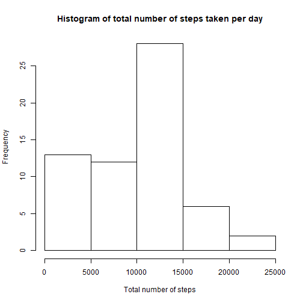
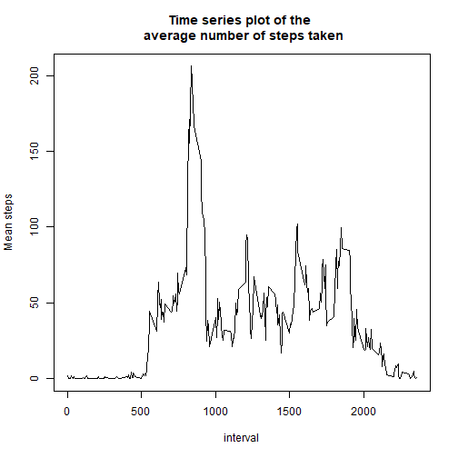
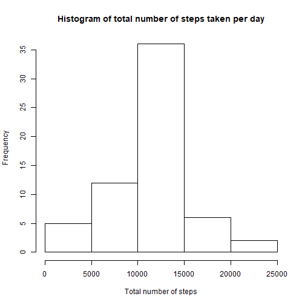
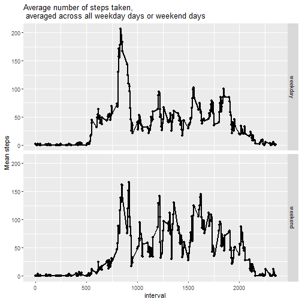

## Loading and preprocessing the data

```r
library(ggplot2)
unzip("./activity.zip")
activityData<-read.csv("activity.csv", header=TRUE)
summary(activityData)
```

```
##      steps                date          interval     
##  Min.   :  0.00   2012-10-01:  288   Min.   :   0.0  
##  1st Qu.:  0.00   2012-10-02:  288   1st Qu.: 588.8  
##  Median :  0.00   2012-10-03:  288   Median :1177.5  
##  Mean   : 37.38   2012-10-04:  288   Mean   :1177.5  
##  3rd Qu.: 12.00   2012-10-05:  288   3rd Qu.:1766.2  
##  Max.   :806.00   2012-10-06:  288   Max.   :2355.0  
##  NA's   :2304     (Other)   :15840
```

1)Check for Missing Data

```r
missingData<-activityData[is.na(activityData$steps),]
dim(missingData)
```

```
## [1] 2304    3
```


## What is mean total number of steps taken per day?
1) First calculate the total number of steps taken


```r
totalSteps<-with(activityData, tapply(steps, as.factor(activityData$date), sum, na.rm = T))
print(totalSteps)
```

```
## 2012-10-01 2012-10-02 2012-10-03 2012-10-04 2012-10-05 2012-10-06 
##          0        126      11352      12116      13294      15420 
## 2012-10-07 2012-10-08 2012-10-09 2012-10-10 2012-10-11 2012-10-12 
##      11015          0      12811       9900      10304      17382 
## 2012-10-13 2012-10-14 2012-10-15 2012-10-16 2012-10-17 2012-10-18 
##      12426      15098      10139      15084      13452      10056 
## 2012-10-19 2012-10-20 2012-10-21 2012-10-22 2012-10-23 2012-10-24 
##      11829      10395       8821      13460       8918       8355 
## 2012-10-25 2012-10-26 2012-10-27 2012-10-28 2012-10-29 2012-10-30 
##       2492       6778      10119      11458       5018       9819 
## 2012-10-31 2012-11-01 2012-11-02 2012-11-03 2012-11-04 2012-11-05 
##      15414          0      10600      10571          0      10439 
## 2012-11-06 2012-11-07 2012-11-08 2012-11-09 2012-11-10 2012-11-11 
##       8334      12883       3219          0          0      12608 
## 2012-11-12 2012-11-13 2012-11-14 2012-11-15 2012-11-16 2012-11-17 
##      10765       7336          0         41       5441      14339 
## 2012-11-18 2012-11-19 2012-11-20 2012-11-21 2012-11-22 2012-11-23 
##      15110       8841       4472      12787      20427      21194 
## 2012-11-24 2012-11-25 2012-11-26 2012-11-27 2012-11-28 2012-11-29 
##      14478      11834      11162      13646      10183       7047 
## 2012-11-30 
##          0
```
2) Then create a histogram of the number of steps taken each day.


```r
hist(totalSteps, main = "Histogram of total number of steps taken per day", xlab = "Total number of steps")
```



3) Finally look at the averages


```r
summary(totalSteps)
```

```
##    Min. 1st Qu.  Median    Mean 3rd Qu.    Max. 
##       0    6778   10395    9354   12811   21194
```
## What is the average daily activity pattern?
1) Make a time series plot (i.e. type = “l”) of the 5-minute interval (x-axis) and the average number of steps taken, 
averaged across all days (y-axis)


```r
#Remove null values
activityData1<-activityData[!is.na(activityData$steps),]
#Create Variables to plot
mean_steps <- with(activityData1, tapply(steps, activityData1$interval, mean))
interval <-(levels(as.factor(activityData1$interval)))
#plot variables
plot(interval, mean_steps, type = "l", main = "Time series plot of the \n average number of steps taken", xlab = "interval", ylab = "Mean steps")
```



2) Determine the 5 minute interval that contains the max number of steps


```r
table <- data.frame(mean_steps, interval)
table[table$mean_steps==max(table$mean_steps),][2]
```

```
##     interval
## 835      835
```
## Imputing missing values

1) Calculate the number of missing values


```r
length(missingData$steps)
```

```
## [1] 2304
```

2) Create a stratagey for filling in missing data. For this exercise I am going to use the averages from the day


```r
mean_steps <- with(activityData1, tapply(steps, activityData1$interval, mean))
missingData$steps <- mean_steps
```

3) Create a new dataset that includes the substitute values


```r
newData <- rbind(activityData1, missingData)
newData <- newData[order(newData$date), ]
```

4) Make a histogram of the total number of steps taken each day and Calculate and report the mean and median total number of steps taken per day. Do these values differ from the estimates from the first part of the assignment? What is the impact of imputing missing data on the estimates of the total daily number of steps?


```r
totalSteps2 <- with(newData, tapply(steps, as.factor(newData$date), sum))
#Make a histogram of the total number of steps taken each day
hist(totalSteps2, main = "Histogram of total number of steps taken per day", xlab = "Total number of steps")
```



5) Calculate the Mean and Median


```r
summary(totalSteps2)
```

```
##    Min. 1st Qu.  Median    Mean 3rd Qu.    Max. 
##      41    9819   10766   10766   12811   21194
```

## Are there differences in activity patterns between weekdays and weekends?

1)create a factor variable for weekday and weekend


```r
newData$days <- weekdays(as.Date(newData$date))
# find weekend features in the dataset
weekend_feature <- grep("Saturday|Sunday", newData$days, ignore.case = T)
# subset data of the weekend
weekend<-  newData[weekend_feature, ]
weekend$weekday <- "weekend"

# subset data of the weekday
weekday <- subset(newData,newData$days!=weekend_feature)
```

```
## Warning in newData$days != weekend_feature: longer object length is not a
## multiple of shorter object length
```

```r
weekday$weekday <- "weekday"

# create a new dataset containing 2 new variable "days" and weekday" 
# - days: indicates the days in the week
# - weekday: indicate the days are at the "weekend" or "weekday"
newData2 <- rbind(weekday, weekend)
```


2)Make a panel plot


```r
meanSteps <- aggregate(steps~ interval+weekday, newData2, mean)
g <- qplot(interval, steps, data = meanSteps, facets = weekday~.)
g + geom_line(size = 1) + ylab("Mean steps") + ggtitle("Average number of steps taken, \n averaged across all weekday days or weekend days ")
```


